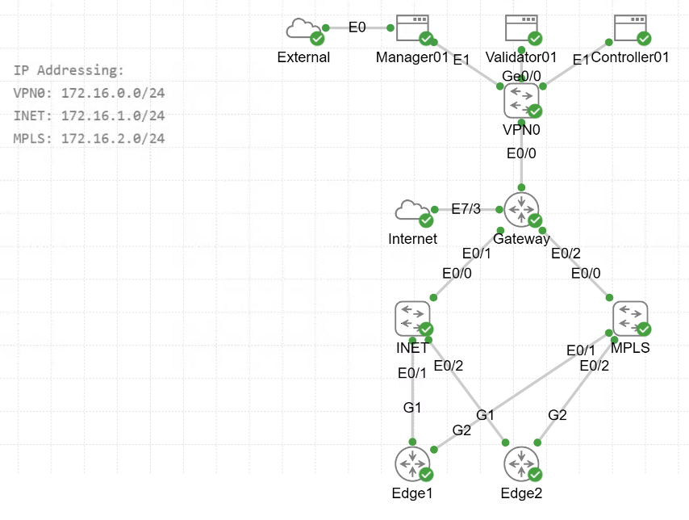
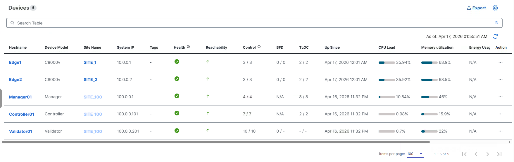
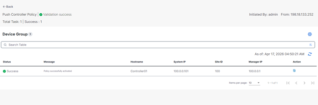
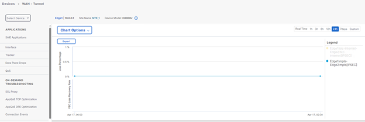
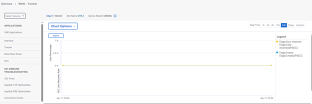
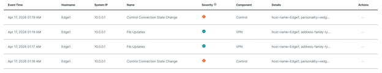

# Cisco SD-WAN Hospital Network Project

> Triển khai hạ tầng SD-WAN cho hệ thống bệnh viện đa khoa  
> trên Cisco dCloud — CML Catalyst SD-WAN 20.18.2.1

---

## 📋 Bài toán thực tế

Một hệ thống bệnh viện đa khoa cần hạ tầng mạng đảm bảo:

- **Dữ liệu y tế quan trọng** (Database, ERP) luôn đi qua
  đường truyền MPLS ổn định, bảo mật
- **Traffic thông thường** (web browsing) đi thẳng ra
  Internet (DIA) để giảm tải băng thông
- **Tự động failover** khi MPLS gặp sự cố,
  không cần can thiệp thủ công

---

## 🏗️ Kiến trúc hệ thống

### Topology: Hub-and-Spoke

```
                    SD-WAN Manager
                    SD-WAN Controller
                    SD-WAN Validator
                         |
              +----------+-----------+
              |                      |
         [Internet]              [MPLS]
              |                      |
    +---------+----------------------+
    |
[Data Center - HQ - Site 100]
    |                         |
[Edge1 - Site 1]    [Edge2 - Site 2]
 Phong kham A        Phong kham B
```

### IP Schema

| Segment           | Subnet        |
| ----------------- | ------------- |
| VPN0 (Management) | 172.16.0.0/24 |
| INET (Internet)   | 172.16.1.0/24 |
| MPLS              | 172.16.2.0/24 |

### Thiết bị

| Thiết bị     | Model   | Site     | System IP   |
| ------------ | ------- | -------- | ----------- |
| Manager01    | vManage | Site 100 | 100.0.0.1   |
| Controller01 | vSmart  | Site 100 | 100.0.0.101 |
| Validator01  | vBond   | Site 100 | 100.0.0.201 |
| Edge1        | C8000v  | Site 1   | 10.0.0.1    |
| Edge2        | C8000v  | Site 2   | 10.0.0.2    |

---

## ⚙️ Cấu hình Policy

### Application-Aware Routing Policy

**Rule 1 — Critical Medical Traffic → MPLS**
Match : Oracle, MS-SQL, SSH
Action : Preferred = MPLS
Backup = Internet

**Rule 2 — Web Traffic → Internet (DIA)**
Match : WEB_TOOLS_APP (HTTP, HTTPS)
Action : Preferred = biz-internet
Backup = MPLS

### Policy Config (từ vManage Preview)

```
app-route-policy _Corp-VPN_Hospital-AAR-Policy
  vpn-list Corp-VPN
    sequence 1
     match
      app-list Critical-Medical-Traffic
     action
      backup-sla-preferred-color mpls biz-internet
    sequence 11
     match
      app-list WEB_TOOLS_APP
     action
      backup-sla-preferred-color biz-internet mpls
```

---

## 🧪 Failover Test Results

### Kịch bản test

- Shutdown interface MPLS thủ công
- Quan sát traffic tự động chuyển sang Internet
- Không can thiệp thủ công

### Kết quả

| Mốc thời gian | Sự kiện                                          |
| ------------- | ------------------------------------------------ |
| 01:16 AM      | MPLS link down — Control Connection State Change |
| 01:17 AM      | Edge1 Fib Updates — routing table cập nhật       |
| 01:19 AM      | Full convergence — traffic chuyển hoàn toàn      |

```
Convergence Time     : ~3 phút
Manual Intervention  : Zero
Validation           : vManage Events Log
```

---

## 📸 Screenshots

### CML Topology



### All Devices Online



### Policy Activated



### Tunnel Before Failover



### Tunnel After Failover (MPLS Down)



### Events Log — Convergence Timeline



---

## 🔄 So sánh SDN/OpenFlow vs Cisco SD-WAN

| Tiêu chí      | SDN/OpenFlow         | Cisco SD-WAN            |
| ------------- | -------------------- | ----------------------- |
| Control Plane | Controller tập trung | vManage + vSmart        |
| Data Plane    | OpenFlow rules       | App-Aware Routing       |
| Policy        | Flow tables          | Centralized Policy      |
| Transport     | Bất kỳ               | MPLS + Internet overlay |
| Scalability   | Hạn chế              | Enterprise-grade        |
| Use Case      | DC/Campus            | WAN Enterprise          |

---

## 🛠️ Công nghệ sử dụng

- Cisco Catalyst SD-WAN 20.18.2.1
- Cisco Modeling Labs (CML) 2.9.1
- Cisco dCloud (APJ - Singapore)
- vManage REST API
- Platform: C8000v Edge Router

---

## 📁 Cấu trúc Repository

```
cisco-sdwan-hospital-lab/
├── README.md
├── topology/
│   └── diagram.png
├── configs/
│   └── policy-preview.txt
├── screenshots/
│   ├── 01-cml-topology.png
│   ├── 02-devices-online.png
│   ├── 03-policy-activated.png
│   ├── 04-tunnel-before-failover.png
│   ├── 05-tunnel-after-failover.png
│   └── 06-events-log.png
└── docs/
    └── failover-test-results.md
```

---

## 🔐 Bảo mật dữ liệu

Toàn bộ traffic giữa các site được mã hóa
qua đường hầm IPsec tự động:

| Tunnel                                       | Encryption | Mục đích     |
| -------------------------------------------- | ---------- | ------------ |
| Edge1:mpls-Edge2:mpls[IPSEC]                 | AES-256    | Dữ liệu y tế |
| Edge1:biz-internet-Edge2:biz-internet[IPSEC] | AES-256    | Backup path  |

→ Đảm bảo tính riêng tư dữ liệu bệnh nhân
theo tiêu chuẩn HIPAA/bảo mật y tế

---

## ⚡ Thách thức kỹ thuật & Giải pháp

| Vấn đề gặp phải                                   | Giải pháp                                   |
| ------------------------------------------------- | ------------------------------------------- |
| Version mismatch: csdwan deploy 20.18.1 not found | Dùng đúng version 20.18.2.1 có trong CML    |
| Edge version khác Controller: 20.18.x → 17.18.x   | Hiểu IOS-XE versioning scheme của Cisco     |
| Authentication failed sau thời gian dài           | Re-run source sdwan.sh mỗi terminal session |
| vManage không real-time                           | Dùng Events Log để đo convergence chính xác |
| Session dCloud giới hạn 5 ngày                    | Dùng csdwan backup/restore để bảo toàn lab  |

---

## 👨‍💻 Tác giả

**Phạm Thanh Lâm**  
Sinh viên ngành Mạng máy tính và truyền thông dữ liệu
Nền tảng: SDN/OpenFlow, Network Programmability  
Platform: Cisco dCloud, NetAcad
